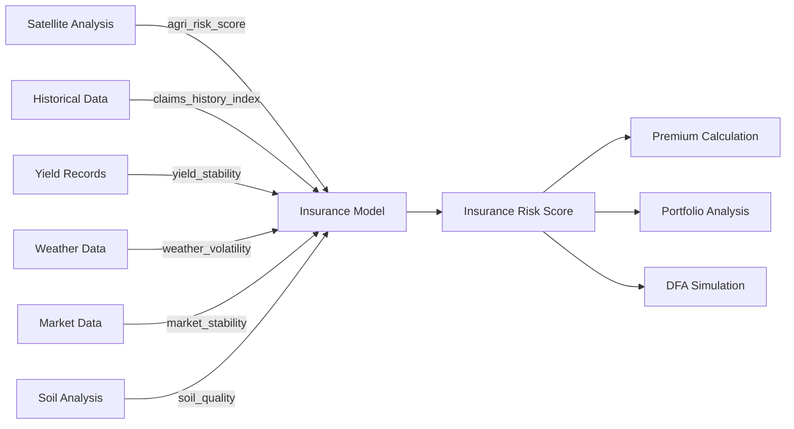

# Sentry: Climate-Dependent Dynamic Financial Analysis for Agricultural Insurance

Agricultural risk assessment and insurance modeling platform powered by satellite imagery, machine learning, and climate-aware financial analysis.

## Research Background

Climate change is expected to have significant long-term effects on the physical, financial, and economic environments, posing substantial risks to the financial stability of general insurers. While Dynamic Financial Analysis (DFA) is widely used to assess financial impacts, traditional DFA models often overlook climate risks. To address this gap, this platform introduces a **climate-dependent DFA framework** that integrates climate risk into DFA, providing a comprehensive assessment of its long-term impact on the general insurance industry.

### Climate-Dependent DFA Framework

The proposed framework has three key features:

1. **Interconnected Asset-Liability Modeling**: Captures the long-term impact of climate change on both assets and liabilities by considering physical and economic dimensions within an interconnected structure
2. **Stochastic Climate Scenario Analysis**: Addresses the uncertainty of climate impacts using stochastic simulations within climate scenario analysis, supporting actuarial applications
3. **Insurance Sector Specialization**: Tailored to the unique characteristics of the general insurance sector, particularly agricultural insurance

This repository contains the implementation and results presented in our research: **"Dynamic Financial Analysis (DFA) of General Insurers under Climate Change."**

## Overview

Sentry is a comprehensive geospatial analytics and insurance risk modeling platform designed to help agricultural insurers, farmers, and agricultural teams identify and quantify climate-related risks. The platform combines real-time satellite data from Google Earth Engine with predictive risk modeling and insurance risk assessment to provide actionable insights for agricultural management, crop protection, and insurance underwriting.

## Key Features

### Agricultural Risk Assessment
- **Interactive Map Interface**: Draw custom analysis regions or select from predefined agricultural areas
- **Satellite Data Integration**: Automated extraction of Sentinel-2 imagery and environmental indicators (NDVI, soil moisture, weather data)
- **Climate-Aware Risk Model**: LightGBM-based pest and disease risk prediction across multiple crop types, incorporating climate variables
- **Real-time Analysis**: WebSocket-powered streaming analysis with progress tracking
- **Visual Results**: Interactive heatmaps, priority zone identification, and satellite image viewer
- **Crop Health Monitoring**: NDVI-based vegetation health assessment and stress detection

### Insurance Risk Modeling
- **Climate-Dependent Insurance Model**: Secondary risk model that integrates agricultural risk scores with financial and actuarial factors
- **Multi-Factor Risk Assessment**: Considers claims history, yield stability, weather volatility, market stability, and soil quality
- **DFA Integration**: Supports dynamic financial analysis for long-term climate impact assessment on insurance portfolios

## Technology Stack

### Frontend
- **Next.js 16** - React framework with App Router
- **TypeScript** - Type-safe development
- **Tailwind CSS** - Utility-first styling
- **Leaflet** - Interactive mapping library
- **React Leaflet** - React bindings for Leaflet

### Backend
- **FastAPI** - High-performance Python API framework
- **Google Earth Engine** - Satellite imagery and geospatial datasets
- **WebSockets** - Real-time bidirectional communication
- **Python 3.11+** - Core backend runtime

### Data & ML
- **Sentinel-2** - High-resolution satellite imagery (10m resolution)
- **Earth Engine Data Catalog** - Environmental and terrain datasets
- **LightGBM Regressor** - Agricultural pest/disease risk prediction model
- **Synthetic Training Data** - 10,000 samples with correlated agricultural features

## Project Structure

```
sentry/
├── backend/              # FastAPI server
│   ├── main.py          # API endpoints and WebSocket handlers
│   ├── models/          # Risk prediction models
│   ├── services/        # Model trainer, feature extraction, risk prediction
│   ├── data/            # Synthetic data generator and training data
│   ├── utils/           # GEE integration, grid generation
│   └── tests/           # Integration and unit tests
│
└── sentry/              # Next.js frontend
    ├── src/
    │   ├── app/         # Next.js App Router pages
    │   ├── components/  # React components
    │   │   ├── Map/     # Leaflet map components
    │   │   ├── Sidebar/ # Analysis controls
    │   │   └── UI/      # Progress, results, modals
    │   └── lib/         # API client, types, utilities
    └── public/          # Static assets
```

## Getting Started

### Prerequisites

- Node.js 18+ and pnpm
- Python 3.11+
- Google Cloud Platform account with Earth Engine API enabled
- GCP service account credentials

### Backend Setup

1. Navigate to the backend directory:
```bash
cd backend
```

2. Create and activate a virtual environment:
```bash
python -m venv venv
source venv/bin/activate  # On Windows: venv\Scripts\activate
```

3. Install dependencies:
```bash
pip install -r requirements.txt
```

4. Add your GCP service account JSON file to the backend directory

5. Start the FastAPI server:
```bash
uvicorn main:app --reload --port 8000
```

### Frontend Setup

1. Navigate to the frontend directory:
```bash
cd sentry
```

2. Install dependencies:
```bash
pnpm install
```

3. Start the development server:
```bash
pnpm dev
```

4. Open http://localhost:3000 in your browser

## Usage

1. **Select Location**: Choose an agricultural area from the dropdown or draw a custom polygon on the map
2. **Configure Parameters**: Set date range, crop type, and risk factors (pests, diseases, weather)
3. **Adjust Options**: Fine-tune grid granularity, display threshold, and enabled map layers
4. **Run Analysis**: Click "Run Analysis" to start the agricultural risk assessment
5. **Review Results**: Examine the risk heatmap, priority zones, and satellite imagery sources

## API Endpoints

- `GET /api/health` - Health check and system status
- `POST /api/analyze` - HTTP-based analysis (synchronous)
- `WebSocket /api/analyze/ws` - Streaming analysis with real-time progress

## Environment Variables

### Backend
- `GOOGLE_APPLICATION_CREDENTIALS` - Path to GCP service account JSON

### Frontend
- `NEXT_PUBLIC_API_URL` - Backend API base URL (default: http://localhost:8000)

## Development

### Running Tests

Backend:
```bash
cd backend
pytest tests/
```

### Code Style

- Frontend: ESLint + Prettier
- Backend: Black + isort

## Model Training

The agricultural risk model uses LightGBM regression trained on synthetic agricultural data. To train or retrain the model:

### Generate Training Data

```bash
cd backend
python data/synthetic_data_generator.py
```

This generates `backend/data/training_data.csv` with 10,000 samples including:
- Geographic features (lat/lng, elevation, slope)
- Crop features (NDVI, crop type, crop stage)
- Environmental features (soil moisture, temperature, humidity)
- Historical pest data (reports, days since last incident)
- Proximity features (distance to water)

### Train the Model

```bash
cd backend
python services/model_trainer.py
```

This will:
1. Load training data from `data/training_data.csv`
2. Perform feature engineering (derived indices, encoding)
3. Train LightGBM regressor with 5-fold cross-validation
4. Save trained model to `models/trained/risk_model_v1.pkl`
5. Generate metadata JSON with performance metrics

### Model Components

- **`data/synthetic_data_generator.py`** - Generates realistic agricultural training data
- **`services/model_trainer.py`** - Trains and evaluates LightGBM model
- **`services/feature_extractor.py`** - Extracts features from satellite data
- **`models/risk_model.py`** - Loads trained model and makes predictions

## Insurance Risk Model

The **Insurance Risk Model** is a critical component of the climate-dependent DFA framework, serving as a bridge between agricultural risk assessment and financial analysis for insurance underwriting and portfolio management.

### Role in Climate-Dependent DFA

The insurance model implements the **asset-liability interconnection** principle of the DFA framework by:

1. **Physical Risk Translation**: Converts agricultural risk scores (derived from satellite data and climate variables) into insurance-relevant metrics
2. **Financial Impact Assessment**: Integrates historical claims data, yield stability, and market conditions to quantify financial exposure
3. **Climate Scenario Support**: Enables stochastic simulation of insurance outcomes under different climate scenarios
4. **Long-term Stability Analysis**: Assesses the impact of climate change on insurance portfolio sustainability

### Model Architecture

**File**: [`backend/models/insurance_model.py`](file:///Users/victorbash/projects/sentry/backend/models/insurance_model.py)

The `InsuranceRiskModel` class implements a singleton pattern to ensure consistent model loading and prediction across the application. It uses a trained machine learning model (LightGBM) to predict insurance risk scores based on multiple input factors.

### Input Features

The model requires six key features that capture different dimensions of climate-related insurance risk:

| Feature | Range | Description | Climate Relevance |
|---------|-------|-------------|-------------------|
| `agri_risk_score` | 0-100 | Agricultural risk score from satellite-based analysis | Direct measure of physical climate impacts on crops |
| `claims_history_index` | 0-1 | Normalized historical claims frequency and severity | Reflects past climate-related losses |
| `yield_stability` | 0-1 | Coefficient of variation in crop yields over time | Indicates climate-induced yield volatility |
| `weather_volatility` | 0-1 | Standard deviation of weather patterns | Measures climate change-driven weather extremes |
| `market_stability` | 0-1 | Price and demand stability index | Economic dimension of climate impacts |
| `soil_quality` | 0-1 | Soil health and degradation index | Long-term physical asset quality under climate stress |

### Model Workflow



### Key Features

- **Singleton Pattern**: Ensures model is loaded once and reused across requests for efficiency
- **Input Validation**: Strict validation of feature ranges to catch data quality issues
- **Flexible Model Loading**: Supports loading from `backend/models/trained/` directory
- **Error Handling**: Comprehensive error messages for debugging and monitoring

### Integration with Agricultural Risk Assessment

The insurance model creates a two-stage risk assessment pipeline:

1. **Stage 1 - Agricultural Risk**: Satellite-based analysis produces `agri_risk_score` (0-100) for specific geographic regions
2. **Stage 2 - Insurance Risk**: Agricultural risk score is combined with financial and historical factors to produce insurance-specific risk metrics

This separation allows:
- **Granular Analysis**: Agricultural risk at grid-cell level (10m-100m resolution)
- **Portfolio Aggregation**: Insurance risk at policy or portfolio level
- **Scenario Testing**: Independent variation of climate (agricultural) vs. economic (market) factors

### Training the Insurance Model

The insurance model is trained separately from the agricultural risk model. To train or retrain:

```bash
cd backend
python services/insurance_model_trainer.py  # If available
```

The model uses historical insurance data combined with agricultural risk scores to learn the relationship between physical climate risks and financial insurance outcomes.

### Use Cases in DFA Framework

1. **Climate Scenario Analysis**: Run agricultural risk assessment under different climate scenarios (RCP 2.6, 4.5, 8.5), then propagate through insurance model to assess financial impacts
2. **Portfolio Stress Testing**: Evaluate insurance portfolio resilience to extreme weather events
3. **Premium Optimization**: Adjust premiums based on climate-adjusted risk scores
4. **Long-term Solvency**: Project insurance company capital requirements under climate change
5. **Reinsurance Strategy**: Identify high-risk regions requiring reinsurance coverage

## Research Paper & Climate Impact Analysis

### Publication

This repository implements the methodology and results from:

**"Dynamic Financial Analysis (DFA) of General Insurers under Climate Change"**

The research addresses a critical gap in actuarial science: the integration of climate risk into traditional Dynamic Financial Analysis frameworks used by insurance companies.

### Climate Change Impacts on Insurance

The framework addresses three interconnected dimensions of climate risk:

#### 1. Physical Dimension
- **Increased Frequency**: More frequent extreme weather events (droughts, floods, heatwaves)
- **Severity Amplification**: Greater intensity of climate-related disasters
- **Geographic Shifts**: Changes in risk distribution across regions
- **Crop Vulnerability**: Direct impacts on agricultural yields and pest/disease patterns

#### 2. Financial Dimension
- **Claims Inflation**: Rising costs of climate-related insurance claims
- **Asset Depreciation**: Reduced value of climate-exposed assets
- **Premium Adequacy**: Need for climate-adjusted pricing models
- **Reserve Requirements**: Higher capital requirements for climate uncertainty

#### 3. Economic Dimension
- **Market Volatility**: Climate-driven commodity price fluctuations
- **Supply Chain Disruption**: Indirect economic impacts on agricultural markets
- **Regulatory Changes**: Evolving climate disclosure and capital requirements
- **Reinsurance Costs**: Increasing cost of risk transfer

### Framework Implementation

This platform operationalizes the theoretical DFA framework through:

1. **Real-time Data Integration**: Google Earth Engine provides current satellite observations for climate variable monitoring
2. **Stochastic Modeling**: Machine learning models capture uncertainty in climate-agriculture-insurance relationships
3. **Scenario Analysis**: Support for multiple climate scenarios (historical baseline, RCP 2.6, 4.5, 8.5)
4. **Spatial Granularity**: Grid-based analysis enables portfolio-level aggregation from field-level risks
5. **Temporal Dynamics**: Time-series analysis of NDVI, weather patterns, and historical claims

### Key Findings & Applications

> [!IMPORTANT]
> The climate-dependent DFA framework demonstrates that traditional insurance models may significantly underestimate long-term climate risks, particularly for agricultural portfolios in climate-vulnerable regions.

**Practical Applications**:
- **Actuarial Pricing**: Climate-adjusted premium calculations for agricultural insurance
- **Capital Planning**: Long-term solvency projections under climate scenarios
- **Risk Management**: Geographic diversification strategies for insurance portfolios
- **Policy Design**: Development of climate-resilient insurance products
- **Regulatory Compliance**: Support for climate risk disclosure requirements (TCFD, ISSB)

### Data Sources & Validation

The framework integrates multiple authoritative data sources:

- **Satellite Data**: Sentinel-2 (ESA), Landsat (NASA/USGS)
- **Climate Data**: ERA5 reanalysis, CHIRPS precipitation
- **Terrain Data**: SRTM elevation, soil databases
- **Historical Records**: Insurance claims data, crop yield statistics
- **Climate Scenarios**: IPCC Representative Concentration Pathways (RCPs)


## Contributing

This project is under active development. For major changes, please open an issue first to discuss proposed modifications.

## License

Proprietary - All rights reserved

## Acknowledgments

- Google Earth Engine for satellite data infrastructure
- Sentinel-2 mission for high-resolution optical imagery and NDVI data
- OpenStreetMap contributors for geographic data
- LightGBM project for gradient boosting framework
